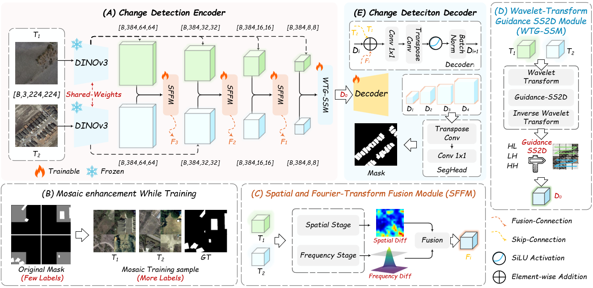
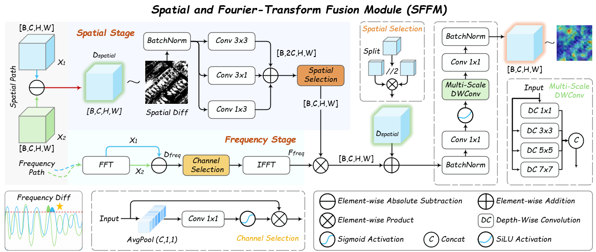
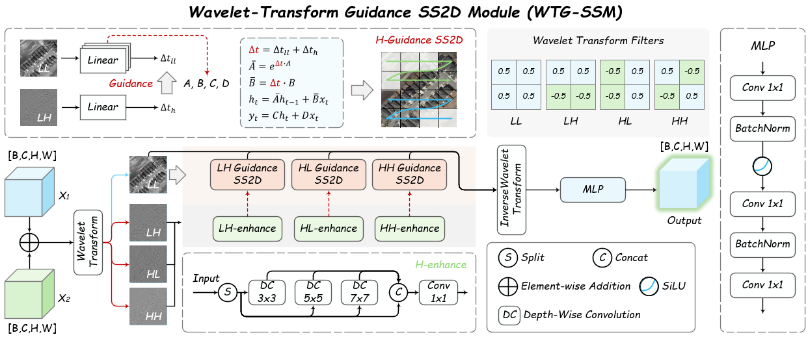
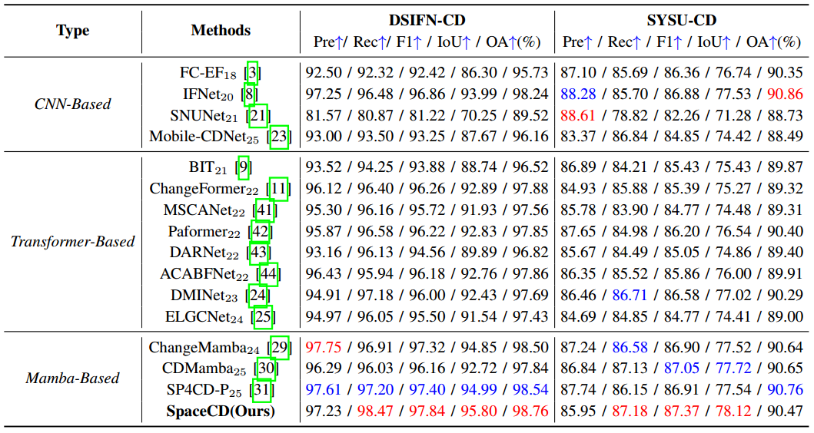
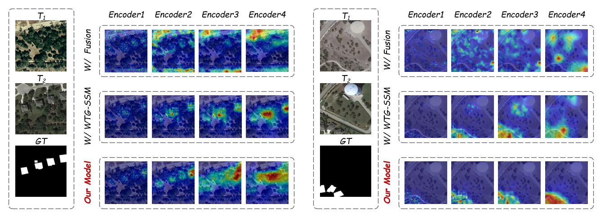

**SpaceCD: A Spatial-Frequency and Patch-Aware Collaborative Method for Change Detection**


## Overview


*The overall architecture of the proposed SpaceCD network. (A) The Change Detection Encoder with Siamese DINOv3 backbone. (B) The Bi-temporal Mosaic Augmentation. (C) The Spatial-Frequency Fusion Module (SFFM). (D) The Wavelet-Transform-Guided SSM (WTG-SSM). (E) The Decoder.*

## Motivation
**Motivation for our Data Augmentation Strategy.** Standard CD datasets often suffer from limited sample diversity and restricted scale variations within single image patches. 
To address this, we approach the challenge from a **patch-aware perspective**. We introduce a **Bi-temporal Mosaic Augmentation** strategy that synthesizes complex scenes from multiple training pairs. This strategy enriches the diversity and contextual richness of local patches while ensuring strict spatial and semantic alignment, significantly boosting model generalization.

## Spatial-Frequency Fusion Module (SFFM)


**Structure of SFFM.** Existing methods often struggle with spectral confusion (e.g., different objects with similar spectra). The SFFM is designed to address this by synergistically integrating spatial difference features with frequency amplitude discrepancies. This fusion effectively suppresses false detections and captures robust global dependencies.

## Wavelet-Transform-Guided SS2D (WTG-SSM)


**Structure of WTG-SSM.** Most Mamba-based methods operate purely in the spatial domain, ignoring high-frequency structural details. Our WTG-SSM leverages **Discrete Wavelet Transform (DWT)** to decouple high- and low-frequency components. Crucially, it utilizes high-frequency cues (e.g., edges) to **explicitly guide** the Mamba scanning process over low-frequency global semantics, ensuring structure-aware feature modeling.

## Results

**Quantitative Results on Benchmark Datasets**


*Comparison with SOTA methods on LEVIR-CD and WHU-CD datasets.*


*Comparison with SOTA methods on CLCD and DSIFN datasets.*

**Qualitative Visual Comparisons**


*Visual comparison of different methods on challenging scenes. SpaceCD (Ours) shows superior performance in preserving fine details and suppressing pseudo-changes.*

## Component Analysis


**Visualization of Module Effectiveness.** 

## Citation

If you find this work helpful for your research, please cite our paper:

```bibtex
@article{your_name2025spacecd,
  title={SpaceCD: A Spatial-Frequency and Patch-Aware Collaborative Method for Change Detection},
  author={Your Name and Co-authors},
  journal={IEEE Transactions on Geoscience and Remote Sensing (Submitted)},
  year={2025}
}
